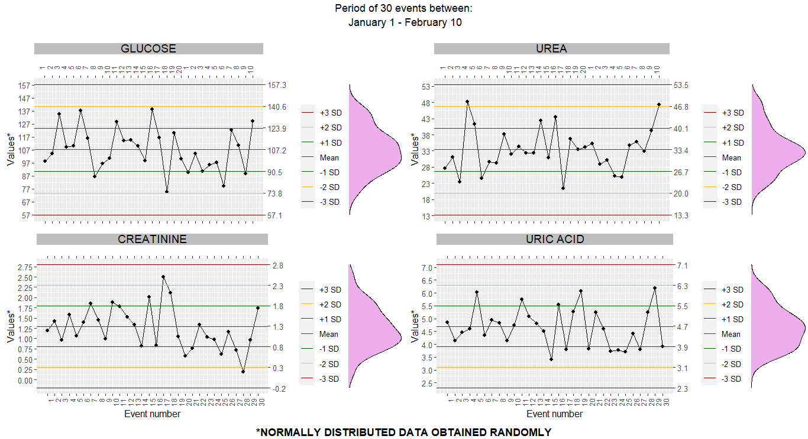

#INTRODUCTION 

Measurements produced by a process are not valid until the performance of the process is evaluated. A method of measurement is in a state of statistical control if we remove significant assignable causes of variation, so “n” finite measurements obtained from the process can be used to predict variation limits and determine confidence limits on which future measurements will lie [1].
Variations among measurements produced by a process are consistent with a stable system if only chance causes are operating; in contrast, more significant variations are obtained with reasons not attributable to chance causes such as reagents, standards, and instruments involved in the analysis [2].
In clinical laboratories, quality-control materials that simulate the patient specimens are used to verify the performance of the testing system, therefore if measurements are close to previous results, the measurement system is adequate to run patient specimens [3]. 

#HYPOTHESIS 

The testing system is in statistical control operating with variations due to chance causes.

#METHODOLOGY 

The HumaTrol N quality control of HUMAN Diagnostics [4] was used as the mean and standard deviation reference of glucose, urea, creatinine, and uric acid parameters. Then, R software [5] was employed to generate 40 random values in a normal distribution using rnorm() function. From these data, only 30 values were analyzed to obtain mean and standard deviation using mean() and sd() functions, respectively. 
Control charts were plotted with range parameter values on the left y-axis and mean and variation limits parameters on the right y-axis. The date of analysis was plotted as the top x-axis and the number of measurement events as the bottom x-axis [2]. Finally, data distribution was examined with a marginal density plot.
Control limits were calculated as mean ± 1 standard deviation, mean ± 2 standard deviation, and mean ± 3 standard deviations [6] for 1 SD in green, 2 SD in yellow, and 3 SD in red, respectively. 

#RESULTS AND DISCUSSION

For statistical quality control, mean and standard deviations are commonly calculated with 20 samples [2], but international proposed guidelines recommend 20-30 data intervals [7], being less than 20 samples not enough to perform the analysis [6].
Normal distribution for each analyzed parameter was generated with points falling inside control limits and no one exceed the mean ± 3 standard deviation limit. 60% of the data fell between the mean ± 1 standard deviation limit for uric acid, and 67% of the data did it for glucose, urea, and creatinine. The 100% of the glucose and uric acid data fell between the mean  ± 2 standard deviation limit, and 93% of the urea and creatinine did it for this limit. These results are close to the 68-95-99.7 rule, meaning that 68% of the values fall between the mean ± 1 standard deviation limit and 95% of the data are inside the mean  ± 2 standard deviation limit in a normal distribution [3].
Only 7% of the values for urea and creatinine data exceed the warning rule, set as the mean ± 2 standard deviation limit, but testing the data with Westgard rules there were no two consecutive points exceeding the warning rule on the same side of the mean [3], [6], therefore the analytical run is in statistical control.

#CONCLUSION

Variations in Levey-Jennings charts for glucose, urea, creatine, and uric acid were due to chance causes so the testing system is in statistical control.

#REFERENCES

[1] G. WERNIMONT, “Statistical Control of Measurement Processes,” in Validation of the Measurement Process, vol. 63, AMERICAN CHEMICAL SOCIETY, 1977, p. 1.

[2] S. LEVEY and E. R. JENNINGS, “The use of control charts in the clinical laboratory.,” Am. J. Clin. Pathol., vol. 20, no. 11, pp. 1059–1066, Nov. 1950, doi: 10.1093/ajcp/20.11_ts.1059.

[3] M. Ball, Clinical Laboratory Mathematics. Pearson Higher Ed, 2013.

[4] HUMAN Diagnostics, “Clinical Chemistry,” 2022. http://www.human-diagnostics.com (accessed Nov. 19, 2022).
[5] R Core Team, “R: A language and Environment for Statistical Computing.” Vienna, 2022, [Online]. Available: https://www.r-project.org.

[6] J. O. Westgard, P. L. Barry, M. R. Hunt, and T. Groth, “A multi-rule Shewhart chart for quality control in clinical chemistry.,” Clin. Chem., vol. 27, no. 3, pp. 493–501, Mar. 1981.

[7] R. Bang, “A Practical Guide To Internal Quality Control (IQC) For Quantitative Tests in Medical Laboratories,” Hong Kong, 2015. [Online]. Available: http://hkaml.org.
